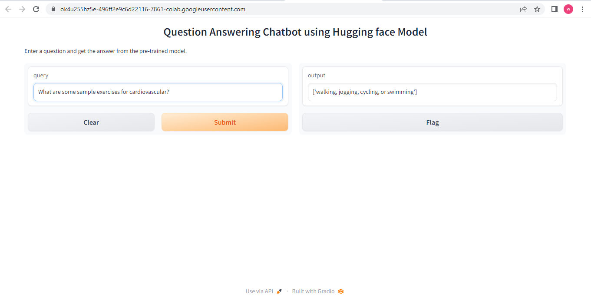

# ChatBot By HuggingFace: Document-based Question Answering

A powerful Question-Answering chatbot developed using Hugging Face's deepset/roberta-base-squad2 model and powered by the efficient Haystack NLP framework.

## Problem statment

Finding specfic answers from documents was time consuming and challenging and to address this problem, there exist a need for any question-answering chatbot that read documents and get answer from the relevant document about which the question should be asked. Traditional methods of manual research and information retrieval are time-consuming and often yield inconclusive results. To address this challenge, we aim to develop a powerful chatbot using the deepset/roberta-base-squad2 model from Hugging Face and the Haystack NLP framework.

## Technical route

The technical route to this chatbot involved using HuggingFace model . The chatbot utilizes the deepset/roberta-base-squad2 model for question answering. Which is trained on question-answer pairs, including unanswerable questions, for the task of Question Answering. It utilizes an in-memory document store to index and store documents, while also employing the BM25 algorithm for efficient document retrieval based on user queries. By integrating a pre-trained MRC model, the system reads and comprehends the candidate documents, extracting the most relevant answer spans to present accurate responses to user questions. This approach enables the chatbot to quickly process information and provide precise answers from the given documents, streamlining the question-answering process for users.

## Output

The output of this project is a powerful and efficient question-answering chatbot capable of providing accurate answers to user queries. When a user submits a question, the chatbot leverages the integrated BM25 retriever to quickly identify the most relevant documents from the indexed knowledge base. It then uses a pre-trained Machine Reading Comprehension (MRC) model, such as deepset/roberta-base-squad2, to read and comprehend the candidate documents, extracting the exact answer spans that address the user's question.

